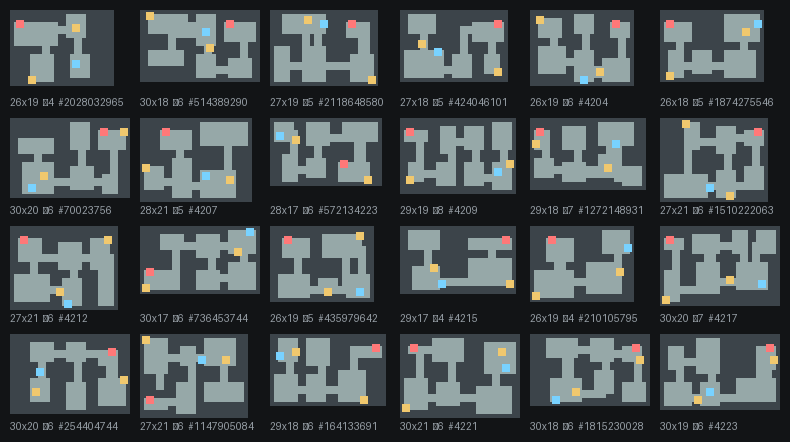
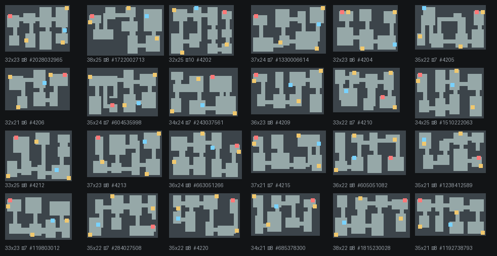
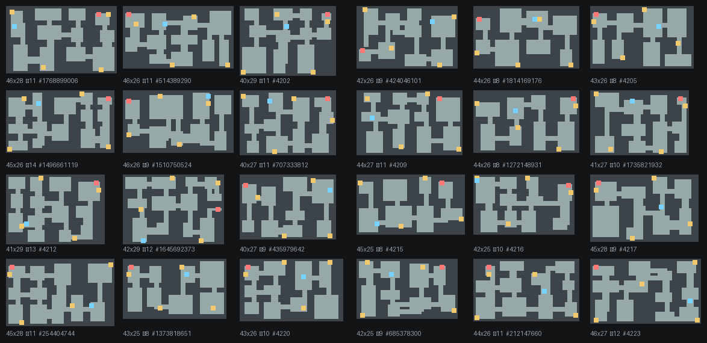

# 맵 생성 — 인수인계 문서

절차적 생성(procedural generation) + 기각 표집(rejection sampling).
**시드 하나가 맵 하나를 완전히 결정한다.** 무작위로 만들고, 규칙을 어기면 버리고 다시 만든다.

진입점: `MapGenerator.Generate(level, seed, out usedSeed)` — [MapGenerator.cs](../Assets/Scripts/Contents/Map/MapGenerator.cs)

---

## 1. 이 시스템이 보장하는 것 (계약)

깨지면 버그다. 전부 테스트로 고정돼 있다.

| 보장 | 검증 |
|---|---|
| 같은 `usedSeed` → 같은 맵 (벽 한 칸까지) | `MapSizeSpecTests.ReplayingTheUsedSeedRebuildsTheSameMap` |
| 시작 → 모든 유물 → 출구가 BFS 도달 가능 (C1) | `HardConstraintTests.C1_*` |
| 시작–출구 최단거리 ≥ 대각선 × 0.55 (C2) | `HardConstraintTests.C2_*` |
| 유물 상호 거리 ≥ 6타일 (C5) | `HardConstraintTests.C5_*` |
| 출구는 연결도 ≥ 2인 방에 (C8) | `HardConstraintTests.C8_*` |
| L1은 시작 5~9타일에 유물 1개 (C10) | `HardConstraintTests.C10_*` |
| 맵 크기가 레벨 범위 안 | `MapSizeSpecTests.SizeStaysInsideTheLevelRange` |
| 보행 비율 35~45% | `MapSizeSpecTests.WalkableBudgetMatchesTheSpec` |
| 서로 다른 시드 → 서로 다른 맵 | `MapSizeSpecTests.DifferentSeedsProduceDifferentMaps` |
| 출구 문이 통행 가능 칸을 안 덮음 | `WallFaceOverlapTests` |
| 데코가 벽 칸을 안 덮음 | `DecoOverlapTests` |

**테스트가 곧 명세다.** 규칙을 바꾸려면 테스트부터 고쳐라.

---

## 2. 파이프라인

```
Generate(level, seed)
 └─ 최대 200회 반복, 후보 시드 = Candidate(seed, n)
     └─ TryBuild
         1. 크기 굴리기        SizeRange.For(level) 범위 내 무작위
         2. BSP 분할          긴 축부터, 절단 위치 40~60% 무작위
                              12x12 이하 리프는 35% 확률로 분할 중단
         3. 방 파기           리프 안쪽 1칸 여백, 크기 4~12 무작위
         4. 복도              x좌표 순 인접 방끼리 L자, 폭 2
         5. 순환로            중심거리 12 이하 방 쌍을 방수 x 0.35개 추가 연결
         6. 보행량 검사       ← 여기서 대부분 기각
         └─ Finish  (시작점 후보 최대 48회)
             7. 시작점 무작위 → BFS
             8. 도달률 90% 미만이면 기각
             9. 출구 후보 = 방 안 + 거리 조건 → 거리 내림차순
            10. 문틀 파내기가 성공한 첫 후보를 출구로 확정
            11. 유물 배치 (출구 3칸 제외, 상호 6타일)
            12. 좀비 스폰 풀 8칸
             └─ Compose  오토타일 + 바닥 변형 + 포인트 기록
```

### 후보 시드가 `seed + n`이 아닌 이유

순차 스캔이면 **실패한 시드들이 전부 같은 성공 시드로 수렴한다.** 실측 결과 시작 시드 24개가 서로 다른 맵 4~6개로 뭉쳤다. `Candidate`가 해시로 흩되 `Candidate(seed, 0) == seed`를 유지해서 재현성은 그대로다.

### 출구를 먼저 확정하는 이유

문 애셋이 3x3(96x96)이라 벽 3칸 깊이가 필요한데, BSP가 만드는 벽 띠는 그만큼 두껍지 않다. 실측: L1은 24개 맵 중 8개만 자연 발생. 그래서 **사후 탐색 대신 `TryCarveDoorway`가 그 자리를 직접 판다.**

파낼 때 그 줄의 바닥 구간을 **좌우 끝까지** 채운다(`FillRun`). 방 안쪽으로 3칸만 파면 벽 덩어리가 튀어나와 "벽에 난 문"이 아니라 "혼자 서 있는 구조물"로 보인다. 방을 한 줄 줄이면 벽면이 평평하게 유지된다. 파낸 뒤 BFS를 다시 돌려 **이전에 갈 수 있던 칸이 하나라도 고립되면 그 후보를 버린다.**

---

## 3. 파라미터

| 이름 | 값 | 위치 |
|---|---|---|
| 맵 크기 | L1 18~22 x 12~15 · L2 24~28 x 15~19 · L3 30~34 x 18~22 | `SizeRange.For` |
| 방 수 | L1 4~6 · L2 6~9 · L3 8~12 | `Spec.For` |
| 보행 타일 | L1 76~148 · L2 126~239 · L3 189~337 | `Spec.MinWalkable/MaxWalkable` |
| 보행 비율 | 35~45% | `MinWalkRatio/MaxWalkRatio` |
| 최소 리프 / 최소 방 / 복도 폭 | 7 / 4 / 2 | `LeafMin` `RoomMin` `CorridorWidth` |
| 재시도 | 맵 200회 · 시작점 48회 | `MaxAttempts` `AnchorTries` |
| 바닥 변형 / noisy 바닥 | 18% / 10% | `FloorVariantChance` `NoisyFloorChance` |
| 데코 비율 | 잔해 = 바닥의 4% · 이끼 = 벽 인접 칸의 20% (코너 가중치 3배) | `DecoSpec` |

수치 출처는 `03_맵생성사양.md` §3·§5와 `04_에셋리스트.md` §2. 코드에 상수를 흩지 말고 `DecoSpec`/`SizeRange`에 모아라.

---

## 4. 직접 확인하는 법

```bash
./Tools/ci_unity.sh -nographics -runTests -testPlatform EditMode
```

```bash
./Tools/ci_unity.sh -runTests -testPlatform PlayMode -testFilter "WallFaceOverlapTests"
```

특정 맵을 재현하려면 `InGameScene.SeedOverride`에 `usedSeed`를 넣는다. 인게임에서는 디버그 오버레이 `R`로 재생성, `3`으로 맵 오버레이.

생성 공간 전체를 보려면 `MapGalleryExportTests` → `Tools/make_gallery.py`.

---

## 5. 생성 공간

시드 24개, 레벨별. 파랑 = 시작, 빨강 = 출구, 노랑 = 유물.





---

## 6. 알려진 한계

**전부 직사각형 방이다.** 24장을 나란히 놓으면 배치만 다르고 구조가 같다는 게 보인다. Kate Compton이 말한 "10,000 그릇의 오트밀" — 수학적으로는 전부 다르지만 플레이어가 구별하지 못하면 의미가 없다.

원인은 우리가 **손으로 만든 조각을 하나도 안 쓴다**는 것이다. 스펠렁키·데드셀·아이작은 전부 수제작 방 템플릿을 조합한다. 우리 쪽에서 수제작에 해당하는 건 출구 문틀 하나뿐이다.

다음 수 두 가지:

1. **방 템플릿** — 방을 연결 방향(N/E/S/W 조합)별 타입으로 나누고, 타입마다 손으로 만든 템플릿 몇 개를 준비해 무작위로 고른다. 좌우 반전으로 배수. 스펠렁키 방식이고 지금 구조 위에 바로 얹을 수 있다.
2. **순환 기반 생성** — 방을 먼저 놓고 잇는 대신, 의도된 순환(가는 길 / 오는 길이 다른 고리)을 먼저 깔고 거기에 지형을 입힌다. Unexplored의 cyclic dungeon generation. 구조를 갈아엎어야 하지만 "손으로 만든 것 같은" 흐름이 나온다.

검증 안 하는 것: §3의 최적 동선 길이(L1 28~42 · L2 45~62 · L3 65~88), C7(추정 시간 × 1.7 ≤ 등불 시간), C3/C4/C9.

---

## 7. 참고

- Kate Compton, [So you want to build a generator…](https://galaxykate0.tumblr.com/post/139774965871/so-you-want-to-build-a-generator) — 생성 공간을 평가하는 언어. "10,000 bowls of oatmeal"
- Joris Dormans, [Unexplored's Secret: Cyclic Dungeon Generation](https://www.gamedeveloper.com/design/unexplored-s-secret-cyclic-dungeon-generation-)
- Boris the Brave, [Dungeon Generation in Unexplored](https://www.boristhebrave.com/2021/04/10/dungeon-generation-in-unexplored/) — 위 기법의 구현 수준 해설
